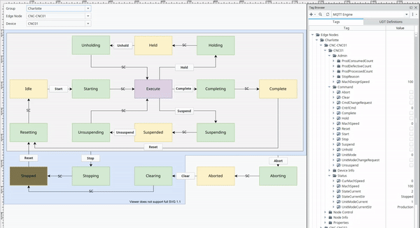

# Manufacturing Line PackML MQTT Simulator

> Manufacturing line simulator interfaced using PackML over MQTT.

PackML MQTT Simulator is a virtual line that interfaces using PackML implemented over MQTT. For use with the development of Industry 4.0 software solutions. The simulator implements the following PackML State model below and communicates over MQTT topics as defined by environmental variables. The simulator can run with either a basic MQTT topic structure or SparkPlugB.


The simulator supports the following topic and payload defintions:

- [Basic MQTT Topic Structure](#interfacing-via-basic-mqtt-topic-structure)
- [SparkplugB v1.0](#interfacing-via-sparkplugb-v10)

## Getting Started

To start and run the PackML simulation, you'll need an MQTT server running and accessible. Once available, the easiest approach is using docker to run the simulation using environmental variables to control the MQTT connection, Site, Area, and line.

### Docker

Start your container with environmental variables.

#### Basic MQTT Structure

```shell
$ docker run -it -e SITE=Site -e AREA=Area -e LINE=Line -e MQTT_URL=mqtt://broker.hivemq.com -m 30m ghcr.io/libremfg/packml-simulator
2020-06-22T03:13:49.301Z | info: Initializing
2020-06-22T03:13:49.817Z | info: Connected to mqtt://broker.hivemq.com:1883
2020-06-22T03:13:49.819Z | info: Site/Area/Line/Status/UnitModeCurrent : Production
```

Once up and running, use an MQTT client to publish to .../Command/Reset and .../Command/Start to get the simulated machine into the execute state. The default topic and payload is Custom as defined below.

#### SparkPlugB

```shell
$ docker run -it -e CLIENT_TYPE=sparkplugb -e SITE=Site -e AREA=Area -e LINE=Line -e MQTT_URL=mqtt://broker.hivemq.com -m 30m ghcr.io/libremfg/packml-simulator
2020-06-22T03:13:49.301Z | info: Initializing
2020-06-22T03:13:49.817Z | info: Connected to mqtt://broker.hivemq.com:1883
2020-06-22T03:13:49.819Z | info: Site/Area/Line/Status/UnitModeCurrent : Production
```

Once up and running, use an Sparkplug B device commands to publish to `Command/Reset` and `Command/Start` metrics to get the simulated machine into the execute state. The topic in the above example is: `spBv1.0/Site/DCMD/Area/Line`.

### Node

#### Basic MQTT Structure

```shell
$ npm i
...
added 421 packages from 213 contributors and audited 421 packages in 12.337s
found 0 vulnerabilities
$ export LINE=Line

$ node --max-old-space-size=20 ./src/index.js
2020-06-22T03:13:49.301Z | info: Initializing
2020-06-22T03:13:49.817Z | info: Connected to mqtt://broker.hivemq.com:1883
2020-06-22T03:13:49.819Z | info: Site/Area/Line/Status/UnitModeCurrent : Production
```

#### SparkPlugB

```shell
$ npm i
...
added 421 packages from 213 contributors and audited 421 packages in 12.337s
found 0 vulnerabilities
$ export LINE=Line
$ export CLIENT_TYPE=sparkplugb

$ node --max-old-space-size=20 ./src/index.js
2021-06-01T20:05:30.841Z | info: Initializing
2021-06-01T20:05:31.141Z | info: Connected to mqtt://broker.hivemq.com:1883
2021-06-01T20:05:31.142Z | info: Site/Area/Line/Status/UnitModeCurrentStr : Production
```

### Publish Commands for Basic MQTT Structure

Please allow some time in between commands to enable the machine to get to the Idle state before issuing the Start command.

```shell
$ docker run --init -it --rm efrecon/mqtt-client pub -h broker.hivemq.com -u USERNAME -P PASSWORD -t "Site/Area/Line/Command/Reset" -m 1

$ docker run --init -it --rm efrecon/mqtt-client pub -h broker.hivemq.com -u USERNAME -P PASSWORD -t "Site/Area/Line/Command/Start" -m 1

```

## Simulation

The simulation consists of

- On Startup, the machine will automatically enter the *Clearing* and then *Stopped* state
- PackML UnitMode command and status
- PackML State Model with commands and status
- Machine Speed (ramping up/down and flicker)
  - Setpoint Observed
  - Status of current speed
  - Machine Design Speed Respected
- Counters
  - 1x Consumed
  - 1x Produced
  - 1x Defective
- Automatic machine suspension/unsuspension from Execute state
- Echo's command of Parameters, RemoteInterface, and Products back onto the status tags

The simulation uses probability dice rolls to determine actions.

## interfacing via Basic MQTT Topic Structure

Interface with the virtual line via the basic MQTT structure. The virtual line subscribes to `<SITE>/<AREA>/<LINE>/Command/*` (see below) and publishes information to `<SITE>/<AREA>/<LINE>/Status` and `<SITE>/<AREA>/<LINE>/Admin`. `<SITE>`, `<AREA>` and `<LINE>` are set using environmental variables.

### Commands

Available Commands

| Topic                                                                         | Values  | Function                                                  |
|-------------------------------------------------------------------------------|---------|-----------------------------------------------------------|
| `<SITE>/<AREA>/<LINE>/Command/Clear`                                          | 1, 0    | Clear Command                                             |
| `<SITE>/<AREA>/<LINE>/Command/Reset`                                          | 1, 0    | Reset Command                                             |
| `<SITE>/<AREA>/<LINE>/Command/Start`                                          | 1, 0    | Start Command                                             |
| `<SITE>/<AREA>/<LINE>/Command/Hold`                                           | 1, 0    | Hold Command                                              |
| `<SITE>/<AREA>/<LINE>/Command/Unhold`                                         | 1, 0    | Unhold Command                                            |
| `<SITE>/<AREA>/<LINE>/Command/Complete`                                       | 1, 0    | Complete Command                                          |
| `<SITE>/<AREA>/<LINE>/Command/Stop`                                           | 1, 0    | Stop Command                                              |
| `<SITE>/<AREA>/<LINE>/Command/Abort`                                          | 1, 0    | Abort Command                                             |
| `<SITE>/<AREA>/<LINE>/Command/UnitMode`                                       | String  | Unit Mode Command (`Production`, `Manual`, `Maintenance`) |
| `<SITE>/<AREA>/<LINE>/Command/MachSpeed`                                      | Decimal | Machine Speed Command                                     |
| `<SITE>/<AREA>/<LINE>/Command/Parameter/*n*/ID`                               | Integer | Parameter *n* ID                                          |
| `<SITE>/<AREA>/<LINE>/Command/Parameter/*n*/Name`                             | String  | Parameter *n* Name                                        |
| `<SITE>/<AREA>/<LINE>/Command/Parameter/*n*/Unit`                             | String  | Parameter *n* Unit                                        |
| `<SITE>/<AREA>/<LINE>/Command/Parameter/*n*/Value`                            | Decimal | Parameter *n* Value                                       |
| `<SITE>/<AREA>/<LINE>/Command/Product/*i*/ID`                                 | Integer | Product *n* ID                                            |
| `<SITE>/<AREA>/<LINE>/Command/Product/*i*/ProcessParameter/*j*/ID`            | Integer | Product *i* Process Parameter *j* ID                      |
| `<SITE>/<AREA>/<LINE>/Command/Product/*i*/ProcessParameter/*j*/Name`          | Integer | Product *i* Process Parameter *j* Name                    |
| `<SITE>/<AREA>/<LINE>/Command/Product/*i*/ProcessParameter/*j*/Unit`          | Integer | Product *i* Process Parameter *j* Unit                    |
| `<SITE>/<AREA>/<LINE>/Command/Product/*i*/ProcessParameter/*j*/Value`         | Integer | Product *i* Process Parameter *j* Value                   |
| `<SITE>/<AREA>/<LINE>/Command/Product/*i*/Ingredient/*j*/ID`                  | Integer | Product *i* Ingredient *n* ID                             |
| `<SITE>/<AREA>/<LINE>/Command/Product/*i*/Ingredient/*j*/Parameter/*k*/ID`    | Integer | Product *i* Ingredient *j* Parameter *k* ID               |
| `<SITE>/<AREA>/<LINE>/Command/Product/*i*/Ingredient/*j*/Parameter/*k*/Name`  | Integer | Product *i* Ingredient *j* Parameter *k* Name             |
| `<SITE>/<AREA>/<LINE>/Command/Product/*i*/Ingredient/*j*/Parameter/*k*/Unit`  | Integer | Product *i* Ingredient *j* Parameter *k* Unit             |
| `<SITE>/<AREA>/<LINE>/Command/Product/*i*/Ingredient/*j*/Parameter/*k*/Value` | Integer | Product *i* Ingredient *j* Parameter *k* Value            |

### Status

Available Status'

| Topic                                                                        | Values  | Function                                                  |
|------------------------------------------------------------------------------|---------|-----------------------------------------------------------|
| `<SITE>/<AREA>/<LINE>/Status/StateCurrent`                                   | String  | Current PackML State                                      |
| `<SITE>/<AREA>/<LINE>/Status/StateCurrentStr`                                | Integer | Current PackML State as String                            |
| `<SITE>/<AREA>/<LINE>/Status/UnitMode`                                       | Integer | Current PackML Model                                      |
| `<SITE>/<AREA>/<LINE>/Status/UnitModeStr`                                    | String  | Current PackML Model as String                            |
| `<SITE>/<AREA>/<LINE>/Status/CurMachSpeed`                                   | Decimal | Current Machine Speed                                     |
| `<SITE>/<AREA>/<LINE>/Status/MachSpeed`                                      | Decimal | Current Machine Speed Setpoint                            |
| `<SITE>/<AREA>/<LINE>/Status/Parameter/*n*/ID`                               | Integer | Parameter *n* ID                                          |
| `<SITE>/<AREA>/<LINE>/Status/Parameter/*n*/Name`                             | String  | Parameter *n* Name                                        |
| `<SITE>/<AREA>/<LINE>/Status/Parameter/*n*/Unit`                             | String  | Parameter *n* Unit                                        |
| `<SITE>/<AREA>/<LINE>/Status/Parameter/*n*/Value`                            | Decimal | Parameter *n* Value                                       |
| `<SITE>/<AREA>/<LINE>/Status/Product/*i*/ID`                                 | Integer | Product *n* ID                                            |
| `<SITE>/<AREA>/<LINE>/Status/Product/*i*/ProcessParameter/*j*/ID`            | Integer | Product *i* Process Parameter *j* ID                      |
| `<SITE>/<AREA>/<LINE>/Status/Product/*i*/ProcessParameter/*j*/Name`          | Integer | Product *i* Process Parameter *j* Name                    |
| `<SITE>/<AREA>/<LINE>/Status/Product/*i*/ProcessParameter/*j*/Unit`          | Integer | Product *i* Process Parameter *j* Unit                    |
| `<SITE>/<AREA>/<LINE>/Status/Product/*i*/ProcessParameter/*j*/Value`         | Integer | Product *i* Process Parameter *j* Value                   |
| `<SITE>/<AREA>/<LINE>/Status/Product/*i*/Ingredient/*j*/ID`                  | Integer | Product *i* Ingredient *n* ID                             |
| `<SITE>/<AREA>/<LINE>/Status/Product/*i*/Ingredient/*j*/Parameter/*k*/ID`    | Integer | Product *i* Ingredient *j* Parameter *k* ID               |
| `<SITE>/<AREA>/<LINE>/Status/Product/*i*/Ingredient/*j*/Parameter/*k*/Name`  | Integer | Product *i* Ingredient *j* Parameter *k* Name             |
| `<SITE>/<AREA>/<LINE>/Status/Product/*i*/Ingredient/*j*/Parameter/*k*/Unit`  | Integer | Product *i* Ingredient *j* Parameter *k* Unit             |
| `<SITE>/<AREA>/<LINE>/Status/Product/*i*/Ingredient/*j*/Parameter/*k*/Value` | Integer | Product *i* Ingredient *j* Parameter *k* Value            |

### Admin

Available Admin Status

| Topic                                                        | Values  | Function                                                  |
|--------------------------------------------------------------|---------|-----------------------------------------------------------|
| `<SITE>/<AREA>/<LINE>/Admin/MachDesignSpeed`                 | String  | Current PackML State                                      |
| `<SITE>/<AREA>/<LINE>/Admin/ProdConsumedCount/*i*/ID`        | String  | Consumed Counter ID                                       |
| `<SITE>/<AREA>/<LINE>/Admin/ProdConsumedCount/*i*/Name`      | String  | Consumed Counter Name                                     |
| `<SITE>/<AREA>/<LINE>/Admin/ProdConsumedCount/*i*/Unit`      | String  | Consumed Counter Units                                    |
| `<SITE>/<AREA>/<LINE>/Admin/ProdConsumedCount/*i*/Count`     | String  | Consumed Counter Count since reset                        |
| `<SITE>/<AREA>/<LINE>/Admin/ProdConsumedCount/*i*/AccCount`  | String  | Consumed Counter Total Count                              |
| `<SITE>/<AREA>/<LINE>/Admin/ProdProcessedCount/*i*/ID`       | String  | Processed Counter ID                                      |
| `<SITE>/<AREA>/<LINE>/Admin/ProdProcessedCount/*i*/Name`     | String  | Processed Counter Name                                    |
| `<SITE>/<AREA>/<LINE>/Admin/ProdProcessedCount/*i*/Unit`     | String  | Processed Counter Units                                   |
| `<SITE>/<AREA>/<LINE>/Admin/ProdProcessedCount/*i*/Count`    | String  | Processed Counter Count since reset                       |
| `<SITE>/<AREA>/<LINE>/Admin/ProdProcessedCount/*i*/AccCount` | String  | Processed Counter Total Count                             |
| `<SITE>/<AREA>/<LINE>/Admin/ProdDefectiveCount/*i*/ID`       | String  | Defective Counter ID                                      |
| `<SITE>/<AREA>/<LINE>/Admin/ProdDefectiveCount/*i*/Name`     | String  | Defective Counter Name                                    |
| `<SITE>/<AREA>/<LINE>/Admin/ProdDefectiveCount/*i*/Unit`     | String  | Defective Counter Units                                   |
| `<SITE>/<AREA>/<LINE>/Admin/ProdDefectiveCount/*i*/Count`    | String  | Defective Counter Count since reset                       |
| `<SITE>/<AREA>/<LINE>/Admin/ProdDefectiveCount/*i*/AccCount` | String  | Defective Counter Total Count                             |

## Interfacing via SparkplugB v1.0

Refer to the [Sparkplug B Payload and Topic Payload Definition Specification](https://www.eclipse.org/tahu/spec/Sparkplug%20Topic%20Namespace%20and%20State%20ManagementV2.2-with%20appendix%20B%20format%20-%20Eclipse.pdf). 

The simulator creates a device and listens to the device commands message (DCMD) topic with metrics representing the available commands without the `<SITE>/<AREA>/<LINE>/` prefix. Consider the command topic `<SITE>/<AREA>/<LINE>/Command/Reset`, when writing as a SparkplugB device command message use the metric name `Command/Reset`. Publishing device command messages are published against `spBv1.0/<SPARKPLUG_GROUP_ID>/DCMD/<SPARKPLUG_EDGE_NODE>/<LINE>` based on site environmental variables.

The simulator will also rebirth when requested at the node level by publishing to `spBv1.0/<SPARKPLUG_GROUP_ID>/NCMD/<SPARKPLUG_EDGE_NODE>` with a metric `Node Control/Rebirth` and a true value.

Below is an example of publishing to Igniition v8.1.5 SCADA with Cirrus Link Modules. The MQTT Engine was configured with the corresponding namespace filter for the simulation environmental variables.



## Environmental Variables

The application is configured using the following environmental variables:

### SITE

The ISA-95 Model site name of this line. SITE used as the parent topic in the MQTT structure. If this is unset, _Site_ will be used.

### AREA

The ISA-95 Model area name of this line. AREA used as the second topic in the MQTT structure. If this is unset, _Area_ will be used.

### LINE

The ISA-95 model line name of this line. LINE used as the third topic in the MQTT structure. If this is unset, hostname will be used.

### MQTT_URL

The address of the MQTT server. If this is unset, _mqtt://broker.hivemq.com_ will be used.

### MQTT_PORT

The port of the MQTT server. If left blank, the MQTT library will try and determine port based on protocol.

### MQTT_USERNAME

The name of the MQTT user with subscribe and publish permissions.

### MQTT_PASSWORD

The password for the MQTT user with subscribe and publish permissions.

### MQTT_CLIENT_ID

The client id to use when connecting to the broker. Defaults to hostname striped of special characters.

### CLIENT_TYPE

The topic and payload specification to use. Valid values are _mqtt_ and _sparkplugb_. Default to _mqtt_.

### SPARKPLUG_GROUP_ID

For use with Sparkplug B specifcation. Defines the group_id. Default value is the `SITE` environmental value or _PackML Simluator_ if `SITE` is not defined.

### SPARKPLUG_EDGE_NODE

For use with Sparkplug B specifcation. Defines the edge_node_id. Default value is the `AREA` environmental value or _site_area_line_ if `AREA` is not defined.

### TICK

The tick speed of the simulation in milliseconds. This is optional. Default is 1000.

## Enterprise Simulation

Use docker-compose to simulate multiple independent lines at once. E.g.

```yml
version: "2.4"

services:
  greenville-packaging-line1:
    image: ghcr.io/libremfg/packml-simulator
    environment:
      SITE: Greenville
      AREA: Packaging
      LINE: 'Line 1'
    mem_limit: 30MB

  greenville-packaging-line2:
    image: ghcr.io/libremfg/packml-simulator
    environment:
      SITE: Greenville
      AREA: Packaging
      LINE: 'Line 2'
    mem_limit: 30MB
  
  greenville-cnc-line1:
    image: ghcr.io/libremfg/packml-simulator
    environment:
      SITE: Greenville
      AREA: CNC
      LINE: 'Line 1'
      CLIENT_TYPE: sparkplugb
    mem_limit: 30MB

```

## Contributing

For any issue, there are fundamentally three ways an individual can contribute:

- By opening the issue for discussion: For instance, if you believe that you have uncovered a bug in, creating a new issue in the [GitHub issue tracker](https://github.com/libremfg/PackML-MQTT-Simulator/issues) is the way to report it.
- By helping to triage the issue: This can be done either by providing supporting details (a test case that demonstrates a bug), or providing suggestions on how to address the issue.
- By helping to resolve the issue: Typically, this is done either in the form of demonstrating that the issue reported is not a problem after all, or more often, by opening a Pull Request that changes some bit of something in the simulator in a concrete and reviewable manner.

## Changelog

- 2.0.5
  - Bump Revision
  - Change base docker image from node:12-alpine to node:20-alpine
  - Change classes with single constructor to a function for maintainability
  - Change multiple inline if statements to one per line for readabilty
  - Change `var` to `const` or `let` where applicable
  - Refactor setInterval to reduce cognitive complexity
  - Update docker metadata
  - Update mqtt from 4.3.8 to 5.10.1
  - Update winston from 3.13.0 to 3.15.0
  - Update standard from 14.3.4 to 17.1.2
  - Update sonarqube-scanner 2.9.1 to 4.2.3
  - Update README

- 2.0.4
  - Update README
  - Update mqtt from 4.2.8 to 4.3.8
  - Update sonarqube-scanner from 2.8.1 to 2.9.1
  - Update sparkplug-client from 3.2.2 to 3.2.4
  - Update winston from 3.3.3 to 3.13.0
  - Bump Revision

- 2.0.3
  - Update path-parse from 1.0.6 to 1.0.7
  - Change README run command env. variable MQTT_HOST to MQTT_URL
  - Bump Revision

- 2.0.2
  - Update mqtt libary from 4.2.1 to 4.2.8
  - Update sonarqube-scanner libary from 2.7.0 to 2.8.1
  - Change simple switch statements for ifs
  - Bump Revision

- 2.0.1
  - Removed unsupported device commands
  - Update Readme
  - Bump Revision

- 2.0.0
  - Add Sparkplug B Payload and Topic Support
  - Add CLIENT_TYPE environmental variable
  - Add SPARKPLUG_GROUP_ID environmental variable
  - Add SPARKPLUG_EDGE_NODE environmental variable
  - Add MQTT_CLIENT_ID environmental variable
  - Add TICK to global configuration
  - Add .../Status/StateCurrentStr topic for string name of state
  - Add .../Status/UnitModeStr topic for string name of mode
  - Changed topic payload for .../Status/StateCurrent to integer data type (use ../Status/StateCurrentStr` instead)
  - Changed topic payload for .../Status/UnitMode to integer data type (use ../Status/UnitModeStr` instead)
  - Change Command tags to boolean values (integer 0/1 still works)
  - Fix UnitMode command
  - Updated README
  - Bump Revision

- 1.0.9
  - Update lodash library from 4.17.19 to 4.17.21
  - Update hosted-git-info from 2.8.8 to 2.8.9

- 1.0.8
  - Add simulation TICK env variable

- 1.0.7
  - Update ini library from 1.3.5 to 1.3.8
  - Add docker container labels

- 1.0.6
  - Update bl library to 1.2.3

- 1.0.5
  - Add Helm chart to deploy to Kubernetes
  
- 1.0.4
  - Add memory limits
  - Changed default LINE to hostname
  - Changed default clientId to MQTTv3.1.1 conforming hostname

- 1.0.3
  - Add NODE_ENV=production to dockerfile
  - Change CMD to use array for better SIGTERM handling

- 1.0.2
  - Add an environmental variable for MQTT Port
  - Fix typos
  - Add logging of mqttClient errors
  - Upgrade MQTT library to v4.2.1
  - Upgrade winston library to v3.3.3
  - Upgrade sonarqube-scanner library to v2.7.0
  - Add port to connected message
  - Update in code capitalization of PackML

- 1.0.1 Update docs
  - Bump npm library versions
  - Fix README subtitle markdown
  - Fix image of state model
  - Check for previous subscription before subscribe
  - Fix docker-compose example
  - Remove console.log

- 1.0.0. Initial Release
