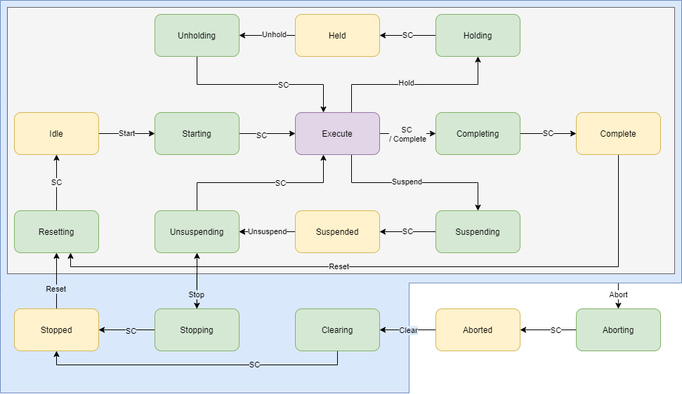

# Manufacturing Line PackML MQTT Simulator

| Manufacturing line simulator interfaced using PackML over MQTT.

PackML MQTT Simulator is a virtual line that interfaces using PackML implemented over MQTT. For use with the development of Industry 4.0 software solutions. The simulator implements the following PackML State model:



and communicates over MQTT using `<SITE>/<AREA>/<LINE>/*` topics as defined by environmental variables.

## Getting Started

To start and run the PackML simulation, you'll need an MQTT server running and accessible to the image. Once available, the easiest approach is using docker to run the simulation using environmental variables to control the MQTT host, Site, Area, and line. Once up and running, use an MQTT client to publish to .../Command/Reset and .../Command/Start to get the simulated machine into the execute state.

### Docker

Start your container with environmental variables

```shell
$ docker run -it -e SITE=Site -e AREA=Area -e LINE=Line -e MQTT_HOST=mqtt://broker.hivemq.com spruiktec/packml-simulator
2020-06-22T03:13:49.301Z | info: Initializing
2020-06-22T03:13:49.817Z | info: Connected to mqtt://broker.hivemq.com
2020-06-22T03:13:49.819Z | info: Site/Area/Line/Status/UnitModeCurrent : Production
```

### Node

```shell
$ npm i
...
added 421 packages from 213 contributors and audited 421 packages in 12.337s
found 0 vulnerabilities
$ node ./src/index.js
2020-06-22T03:13:49.301Z | info: Initializing
2020-06-22T03:13:49.817Z | info: Connected to mqtt://broker.hivemq.com
2020-06-22T03:13:49.819Z | info: Site/Area/Line/Status/UnitModeCurrent : Production
```

### Publish Commands

Please allow some time in between commands to enable the machine to get to the Idle state before issuing the Start command.

```shell
$ docker run --init -it --rm efrecon/mqtt-client pub -h broker.hivemq.com -u USERNAME -P PASSWORD -t "Site/Area/Line/Command/Reset" -m 0

$ docker run --init -it --rm efrecon/mqtt-client pub -h broker.hivemq.com -u USERNAME -P PASSWORD -t "Site/Area/Line/Command/Start" -m 0

```

## Simulation

The simulation consists of

- On Startup, the machine will automatically enter the *Clearing* and then *Stopped* state
- PackML UnitMode command and status
- PackML State Model with commands and status
- Machine Speed (ramping up/down and flicker)
  - Setpoint Observed
  - Status of current speed
  - Machine Design Speed Respected
- Counters
  - 1x Consumed
  - 1x Produced
  - 1x Defective
- Automatic machine suspension/unsuspension from Execute state
- Echo's command of Parameters, RemoteInterface, and Products back onto the status tags

The simulation uses probability dice rolls to determine actions.

## Interfacing

Interface with the virtual line via MQTT. The virtual line subscribes to `<SITE>/<AREA>/<LINE>/Command/*` (see below) and publishes information to `<SITE>/<AREA>/<LINE>/Status` and `<SITE>/<AREA>/<LINE>/Admin`. `<SITE>`, `<AREA>` and `<LINE>` are set using environmental variables.

### Commands

Available Commands

| Topic                                                                         | Values  | Function                                                  |
|-------------------------------------------------------------------------------|---------|-----------------------------------------------------------|
| `<SITE>/<AREA>/<LINE>/Command/Clear`                                          | 1, 0    | Clear Command                                             |
| `<SITE>/<AREA>/<LINE>/Command/Reset`                                          | 1, 0    | Reset Command                                             |
| `<SITE>/<AREA>/<LINE>/Command/Start`                                          | 1, 0    | Start Command                                             |
| `<SITE>/<AREA>/<LINE>/Command/Hold`                                           | 1, 0    | Hold Command                                              |
| `<SITE>/<AREA>/<LINE>/Command/Unhold`                                         | 1, 0    | Unhold Command                                            |
| `<SITE>/<AREA>/<LINE>/Command/Complete`                                       | 1, 0    | Complete Command                                          |
| `<SITE>/<AREA>/<LINE>/Command/Stop`                                           | 1, 0    | Stop Command                                              |
| `<SITE>/<AREA>/<LINE>/Command/Abort`                                          | 1, 0    | Abort Command                                             |
| `<SITE>/<AREA>/<LINE>/Command/UnitMode`                                       | String  | Unit Mode Command (`Production`, `Manual`, `Maintenance`) |
| `<SITE>/<AREA>/<LINE>/Command/MachSpeed`                                      | Decimal | Machine Speed Command                                     |
| `<SITE>/<AREA>/<LINE>/Command/Parameter/*n*/ID`                               | Integer | Parameter *n* ID                                          |
| `<SITE>/<AREA>/<LINE>/Command/Parameter/*n*/Name`                             | String  | Parameter *n* Name                                        |
| `<SITE>/<AREA>/<LINE>/Command/Parameter/*n*/Unit`                             | String  | Parameter *n* Unit                                        |
| `<SITE>/<AREA>/<LINE>/Command/Parameter/*n*/Value`                            | Decimal | Parameter *n* Value                                       |
| `<SITE>/<AREA>/<LINE>/Command/Product/*i*/ID`                                 | Integer | Product *n* ID                                            |
| `<SITE>/<AREA>/<LINE>/Command/Product/*i*/ProcessParameter/*j*/ID`            | Integer | Product *i* Process Parameter *j* ID                      |
| `<SITE>/<AREA>/<LINE>/Command/Product/*i*/ProcessParameter/*j*/Name`          | Integer | Product *i* Process Parameter *j* Name                    |
| `<SITE>/<AREA>/<LINE>/Command/Product/*i*/ProcessParameter/*j*/Unit`          | Integer | Product *i* Process Parameter *j* Unit                    |
| `<SITE>/<AREA>/<LINE>/Command/Product/*i*/ProcessParameter/*j*/Value`         | Integer | Product *i* Process Parameter *j* Value                   |
| `<SITE>/<AREA>/<LINE>/Command/Product/*i*/Ingredient/*j*/ID`                  | Integer | Product *i* Ingredient *n* ID                             |
| `<SITE>/<AREA>/<LINE>/Command/Product/*i*/Ingredient/*j*/Parameter/*k*/ID`    | Integer | Product *i* Ingredient *j* Paramter *k* ID                |
| `<SITE>/<AREA>/<LINE>/Command/Product/*i*/Ingredient/*j*/Parameter/*k*/Name`  | Integer | Product *i* Ingredient *j* Paramter *k* Name              |
| `<SITE>/<AREA>/<LINE>/Command/Product/*i*/Ingredient/*j*/Parameter/*k*/Unit`  | Integer | Product *i* Ingredient *j* Paramter *k* Unit              |
| `<SITE>/<AREA>/<LINE>/Command/Product/*i*/Ingredient/*j*/Parameter/*k*/Value` | Integer | Product *i* Ingredient *j* Paramter *k* Value             |

### Status

Available Status'

| Topic                                                                        | Values  | Function                                                  |
|------------------------------------------------------------------------------|---------|-----------------------------------------------------------|
| `<SITE>/<AREA>/<LINE>/Status/StateCurrent`                                   | String  | Current PackML State                                      |
| `<SITE>/<AREA>/<LINE>/Status/UnitMode`                                       | String  | Current PackML Model                                      |
| `<SITE>/<AREA>/<LINE>/Status/CurMachSpeed`                                   | Decimal | Current Machine Speed                                     |
| `<SITE>/<AREA>/<LINE>/Status/MachSpeed`                                      | Decimal | Current Machine Speed Setpoint                            |
| `<SITE>/<AREA>/<LINE>/Status/Parameter/*n*/ID`                               | Integer | Parameter *n* ID                                          |
| `<SITE>/<AREA>/<LINE>/Status/Parameter/*n*/Name`                             | String  | Parameter *n* Name                                        |
| `<SITE>/<AREA>/<LINE>/Status/Parameter/*n*/Unit`                             | String  | Parameter *n* Unit                                        |
| `<SITE>/<AREA>/<LINE>/Status/Parameter/*n*/Value`                            | Decimal | Parameter *n* Value                                       |
| `<SITE>/<AREA>/<LINE>/Status/Product/*i*/ID`                                 | Integer | Product *n* ID                                            |
| `<SITE>/<AREA>/<LINE>/Status/Product/*i*/ProcessParameter/*j*/ID`            | Integer | Product *i* Process Parameter *j* ID                      |
| `<SITE>/<AREA>/<LINE>/Status/Product/*i*/ProcessParameter/*j*/Name`          | Integer | Product *i* Process Parameter *j* Name                    |
| `<SITE>/<AREA>/<LINE>/Status/Product/*i*/ProcessParameter/*j*/Unit`          | Integer | Product *i* Process Parameter *j* Unit                    |
| `<SITE>/<AREA>/<LINE>/Status/Product/*i*/ProcessParameter/*j*/Value`         | Integer | Product *i* Process Parameter *j* Value                   |
| `<SITE>/<AREA>/<LINE>/Status/Product/*i*/Ingredient/*j*/ID`                  | Integer | Product *i* Ingredient *n* ID                             |
| `<SITE>/<AREA>/<LINE>/Status/Product/*i*/Ingredient/*j*/Parameter/*k*/ID`    | Integer | Product *i* Ingredient *j* Paramter *k* ID                |
| `<SITE>/<AREA>/<LINE>/Status/Product/*i*/Ingredient/*j*/Parameter/*k*/Name`  | Integer | Product *i* Ingredient *j* Paramter *k* Name              |
| `<SITE>/<AREA>/<LINE>/Status/Product/*i*/Ingredient/*j*/Parameter/*k*/Unit`  | Integer | Product *i* Ingredient *j* Paramter *k* Unit              |
| `<SITE>/<AREA>/<LINE>/Status/Product/*i*/Ingredient/*j*/Parameter/*k*/Value` | Integer | Product *i* Ingredient *j* Paramter *k* Value             |

### Admin

Available Admin Status

| Topic                                                        | Values  | Function                                                  |
|--------------------------------------------------------------|---------|-----------------------------------------------------------|
| `<SITE>/<AREA>/<LINE>/Admin/MachDesignSpeed`                 | String  | Current PackML State                                      |
| `<SITE>/<AREA>/<LINE>/Admin/ProdConsumedCount/*i*/ID`        | String  | Consumed Counter ID                                       |
| `<SITE>/<AREA>/<LINE>/Admin/ProdConsumedCount/*i*/Name`      | String  | Consumed Counter Name                                     |
| `<SITE>/<AREA>/<LINE>/Admin/ProdConsumedCount/*i*/Unit`      | String  | Consumed Counter Units                                    |
| `<SITE>/<AREA>/<LINE>/Admin/ProdConsumedCount/*i*/Count`     | String  | Consumed Counter Count since reset                        |
| `<SITE>/<AREA>/<LINE>/Admin/ProdConsumedCount/*i*/AccCount`  | String  | Consumed Counter Total Count                              |
| `<SITE>/<AREA>/<LINE>/Admin/ProdProcessedCount/*i*/ID`       | String  | Processed Counter ID                                      |
| `<SITE>/<AREA>/<LINE>/Admin/ProdProcessedCount/*i*/Name`     | String  | Processed Counter Name                                    |
| `<SITE>/<AREA>/<LINE>/Admin/ProdProcessedCount/*i*/Unit`     | String  | Processed Counter Units                                   |
| `<SITE>/<AREA>/<LINE>/Admin/ProdProcessedCount/*i*/Count`    | String  | Processed Counter Count since reset                       |
| `<SITE>/<AREA>/<LINE>/Admin/ProdProcessedCount/*i*/AccCount` | String  | Processed Counter Total Count                             |
| `<SITE>/<AREA>/<LINE>/Admin/ProdDefectiveCount/*i*/ID`       | String  | Defective Counter ID                                      |
| `<SITE>/<AREA>/<LINE>/Admin/ProdDefectiveCount/*i*/Name`     | String  | Defective Counter Name                                    |
| `<SITE>/<AREA>/<LINE>/Admin/ProdDefectiveCount/*i*/Unit`     | String  | Defective Counter Units                                   |
| `<SITE>/<AREA>/<LINE>/Admin/ProdDefectiveCount/*i*/Count`    | String  | Defective Counter Count since reset                       |
| `<SITE>/<AREA>/<LINE>/Admin/ProdDefectiveCount/*i*/AccCount` | String  | Defective Counter Total Count                             |

## Environmental Variables

The application is configured using the following environmental variables:

### SITE

The ISA-95 Model site name of this line. SITE used as the parent topic in the MQTT structure. If this is unset, _Site_ will be used.

### AREA

The ISA-95 Model area name of this line. AREA used as the second topic in the MQTT structure. If this is unset, _Area_ will be used.

### LINE

The ISA-95 model line name of this line. LINE used as the third topic in the MQTT structure. If this is unset, _Line_ will be used.

### MQTT_URL

The address of the MQTT server. If this is unset, _mqtt://broker.hivemq.com_ will be used.

### MQTT_USERNAME

The name of the MQTT user with subscribe and publish permissions.

### MQTT_PASSWORD

The password for the MQTT user with subscribe and publish permissions.

## Enterprise Simulation

Use docker-compose to simulate multiple independent lines at once. E.g.

```yml
version: "3.7"

services:
  greenville-packaging-line1:
    image: spruiktec/packml-simulator
    environment:
      SITE: Greenville
      AREA: Packaging
      LINE: 'Line 1'
  greenville-packaging-line1:
    image: spruiktec/packml-simulator
    environment:
      SITE: Greenville
      AREA: Packaging
      LINE: 'Line 2'
  ...
```

## Contributing

For any issue, there are fundamentally three ways an individual can contribute:

- By opening the issue for discussion: For instance, if you believe that you have uncovered a bug in, creating a new issue in the  is the way to report it.
- By helping to triage the issue: This can be done either by providing supporting details (a test case that demonstrates a bug), or providing suggestions on how to address the issue.
- By helping to resolve the issue: Typically, this is done either in the form of demonstrating that the issue reported is not a problem after all, or more often, by opening a Pull Request that changes some bit of something in the simulator in a concrete and reviewable manner.

## Changelog

- 1.0.0. Initial Release
